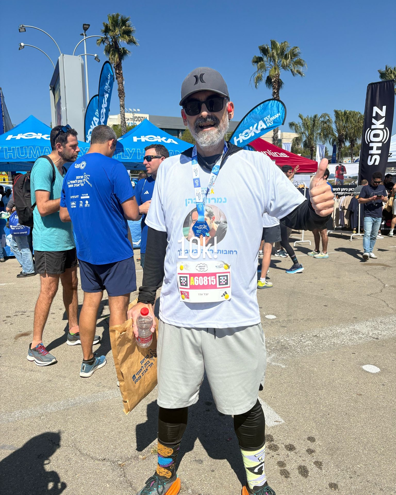

<section class="home-hero">
  

    
Getting Healthier Without The Nonsense

    <h1>Healthy After 45</h1>
    
No miracle transformation. No heroic thirty-day challenge. Just one stubborn Gen-X adult fixing decades of bad decisions, one habit at a time.

    

      <a class="hero-button hero-button-primary" href="./Timeline">Read My Story</a>
      <a class="hero-button hero-button-secondary" href="./articles">Browse Articles</a>
    

  

  <figure class="home-hero-visual">
    
    <figcaption>Suspiciously cheerful after finishing the Tel Aviv Marathon 10K.</figcaption>
  </figure>
</section>

At 47, I was severely overweight, my type 2 diabetes was running the show, and my cardiovascular system had apparently decided that four blocked arteries were a perfectly reasonable design choice. I came far too close to dying. That has a way of clearing the schedule and rearranging your priorities.

A couple of years later, I am no longer morbidly obese, my diabetes is in remission, and I am healthier than I have ever been. I run, lift weights, eat like an adult most of the time, and have accumulated enough running shoes to undermine any claim that running is a cheap hobby.

## What this site is about

This is not a miracle-transformation sales pitch, and I am not here to sell a detox, a supplement, or twelve easy payments of anything. It is a personal account of what worked for me, what failed, what I learned, and what I am still figuring out.

You can start with the [[Timeline|full timeline]], browse the [[Articles|blog]], try the [[calculators|health calculators]], or inspect the completely reasonable amount of [[Gear|gear]] one person can accumulate in the name of fitness.

I am not a doctor, dietitian, or personal trainer. I am one person describing my own experience, with all the limitations that implies. Please read the [[Disclaimer]] before treating anything here as advice.
