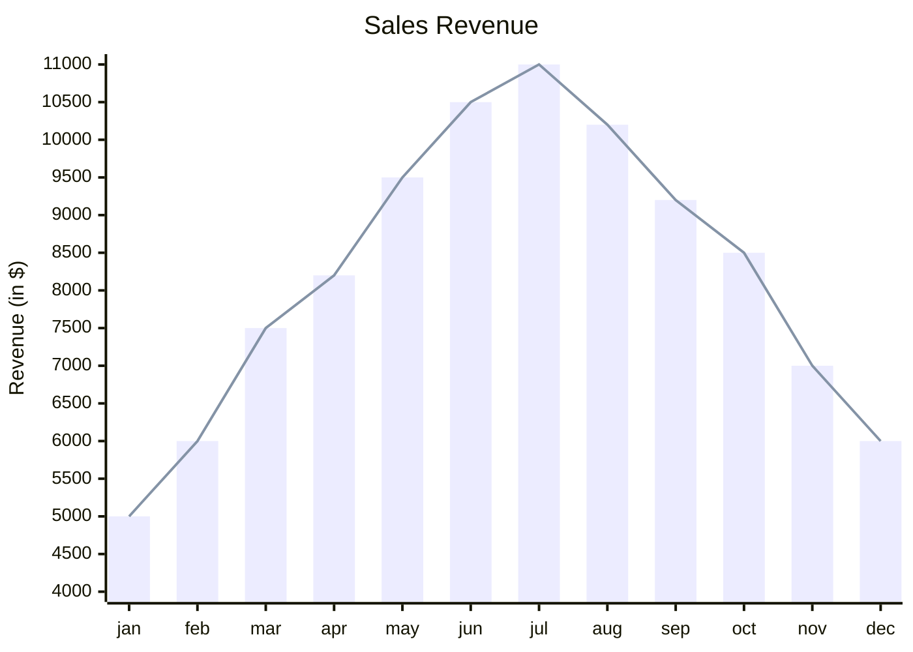

# [[playground]]

```dataviewjs
dv.span("**Steps**")

const pages = dv.pages('"daily logs/April"').sort(p => p.file.name) 
const dates = pages.map(p => p.file.name) 
const steps = pages.map(p => p.steps).values 

const chartData = { 
  type: 'line', 
  data: { 
    labels: dates, 
    datasets: [{ 
      label: 'Steps', 
      data: steps, 
      backgroundColor: [ 'rgba(53, 252, 167, 1)' ], 
      borderColor: [ 'rgba(138, 102, 204, 0.8)' ], 
      borderWidth: 1.5, 
      spanGaps: true, 
      }], 
    }, 
}; 

const Mermaid = `xychart-beta
    title Test 1 2 3 
    x-axis ${dates}
    y-axis "Steps" 
    bar [${steps}]
    line [${steps}]
    `;
dv.paragraph('```mermaid\n' + Mermaid + '\n```');

```



