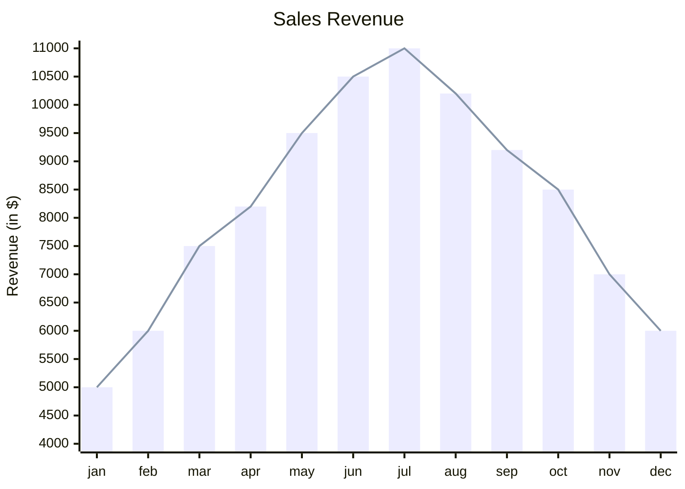

# [[playground]]

```dataviewjs
dv.span("**Steps**")

const pages = dv.pages('"daily logs/April"').sort(p => p.file.name) 
const dates = pages.map(p => p.file.name) 
const steps = pages.map(p => p.steps).values 

const chartData = { 
  type: 'line', 
  data: { 
    labels: dates, 
    datasets: [{ 
      label: 'Steps', 
      data: steps, 
      backgroundColor: [ 'rgba(53, 252, 167, 1)' ], 
      borderColor: [ 'rgba(138, 102, 204, 0.8)' ], 
      borderWidth: 1.5, 
      spanGaps: true, 
      }], 
    }, 
}; 

window.renderChart(chartData, this.container)
```

```chartsview
#-----------------#
#- chart type    -#
#-----------------#
type: Line

#-----------------#
#- chart data    -#
#-----------------#
data:
  - label: "1951"
    value: 38
  - label: "1952"
    value: 52
  - label: "1956"
    value: 61
  - label: "1957"
    value: 145
  - label: "1958"
    value: 48

#-----------------#
#- chart options -#
#-----------------#
options:
  xField: label
  yField: value
```

```chart
type: bar
labels: [dates]
series:
  - title: 
    data: [1,2,3,4,5] 
 
tension: 0.2
width: 80%
labelColors: false
fill: false
beginAtZero: false
bestFit: false
bestFitTitle: undefined
bestFitNumber: 0
```


